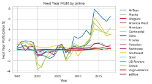
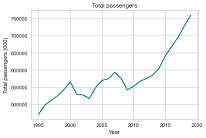

# Predicting potential future trends in airline profitability

In this project I learnt a lot about how to use LaTex to write up a report, as well as using research questions to guide the data science process. The data comes from [MIT's Airline Data Project](http://web.mit.edu/airlinedata/www/AboutUs.html). The main report is in report.pdf and the notebook in Notebook.ipynb. It would have been interesting to see the effect of COVID-19 on the airlines' profitability, but the data was not available when I carried out this report.

## Conda environment

To setup the conda environment use:

```bash
conda env create -f environment.yml python=3.8
conda activate PODSCW2
```

Or alternatively use the requirements.txt file to install the dependancies

## Get the data

To get the data run:

```bash
py data/getFlightData.py
```

## Pictures

Next year's profits by airline:



Total Passenger Numbers:


